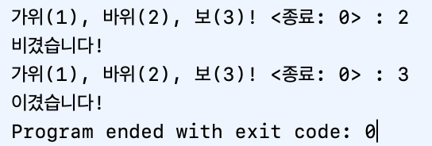
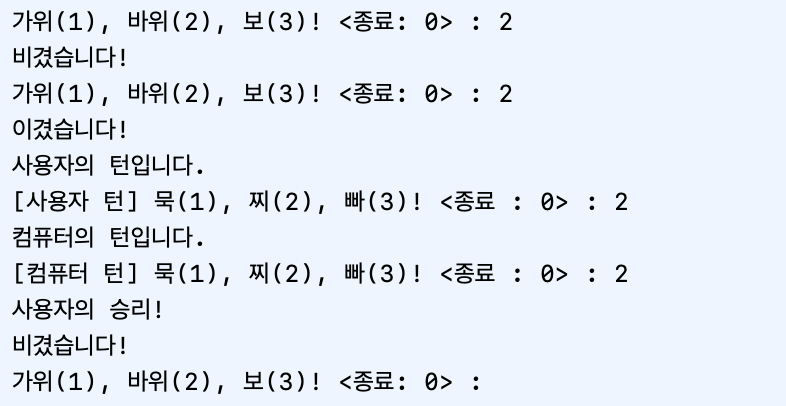
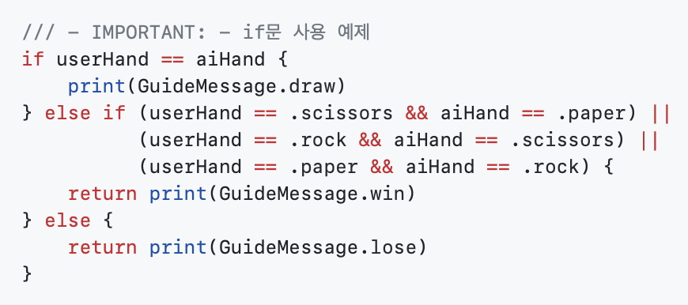
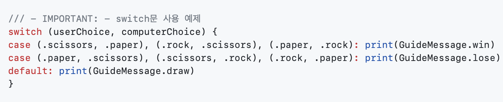
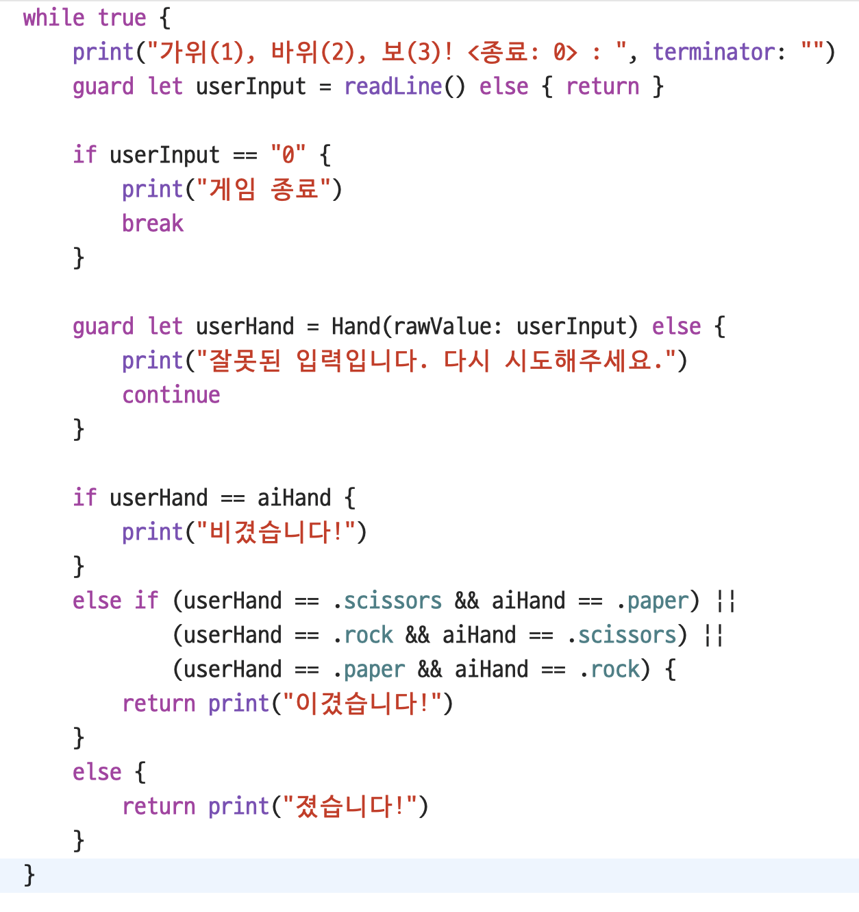
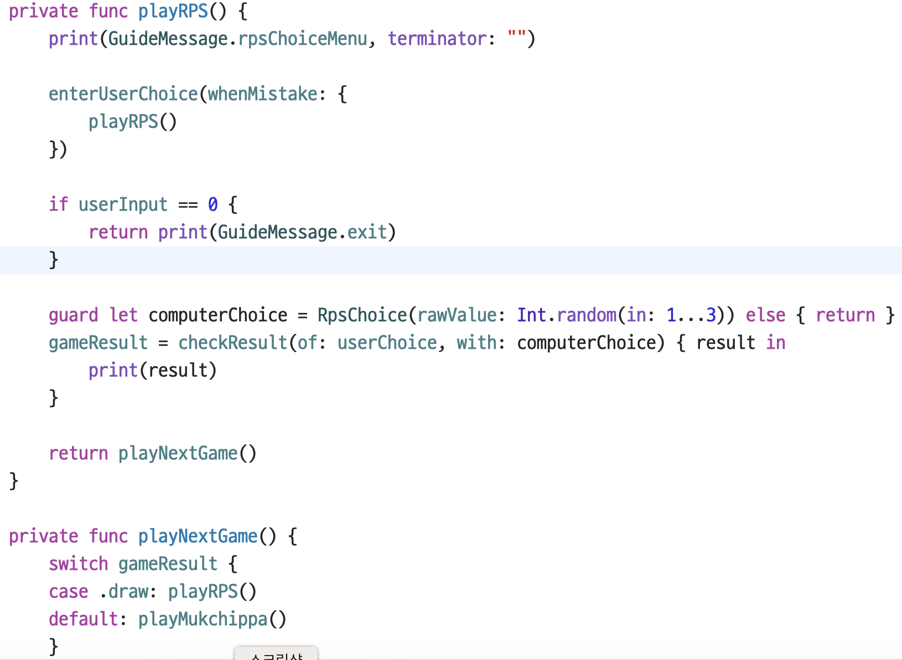
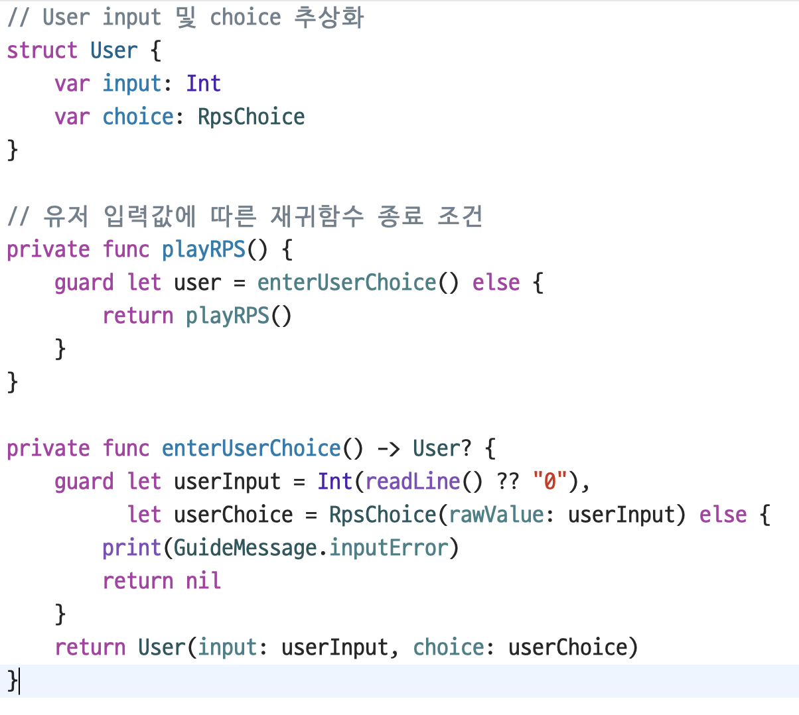

# 👊🏻 ✋🏻 ✌🏻 묵찌빠 프로젝트
### 가위, 바위, 보를 진행후 묵찌빠 게임으로 전환

## 👨🏻‍💻 팀원

|||
|:-:|:-:|
|Comdori|Eddy|

## 📸 스크린샷
|가위바위보|묵찌빠|
|:-:|:-:|
||||
|비기면 다시, 이기거나 지면 종료|비기면 종료, 이기거나 지면 다시|

## 🤔 이슈, 고민
- if문의 명확성과 switch문의 간결성에 대한 고민

|if문|switch문|
|:-:|:-:|
|||

- 반복문의 편의성과 재귀함수의 리스크관리 및 장점에 대한 고민

|반복문|재귀함수|
|:-:|:-:|
|||

- 재귀함수의 종료조건을 충족시키기 위해서 내부함수를 이용해서 외부함수를 종료 시키는 방법에 대한 고민

- nameSpace의 사용 목적 고민
- <a href="https://swift.org/documentation/api-design-guidelines/">Swift API Design Guidelines</a> 특히 Naming 파트 고민

## 🫠 느낀점
- Comdori : 항상 내 방식대로 프로그래밍을 하다가 처음 으로 짝-프로그래밍과 각종 룰(?)을 적용해 진행해 보았는데 내가 생각하지 못한 좋은 로직이 있음을 경험 하였고, 협업에서 지켜야 하는 규칙들이 중요한지를 알 수 있어서 좋은 시간이 되었던 것 같다. 더불어 리뷰어 PR을 통해 프로젝트외 다른 사항도 고민해볼수 있는 시간이 있어서 배우는 즐거움을 느꼈다.
- Eddy : 생각보다 쉽지 않았다. 가위바위보, 묵찌빠만으로도 Swift문법을 모두 긁어모아 사용해야 했고, 다양한 변수가 생성되어 네이밍에서 더 신경을 써야 했다. 
지금껏 리스크관리가 필요한 재귀함수는 잘 사용하지 않았었는데, 재귀함수를 사용해보니 코드 뎁스가 줄어 코드가 깔끔해보이는 효과를 얻을 수 있었다. 짝프로그래밍을 하면서 알고 있다고 생각한 개념을 설명하는 과정도 연습이 필요하다는 것을 느꼈다. 또한 리뷰어로부터 내 코드에 대해 리뷰를 받을 수 있고, 그 과정에서 애매하다 생각하는 부분들을 질문할 수 있었기에 유익한 시간이었다.
