# 콘솔 묵찌빠 앱

콘솔에서 한 명의 사용자가 컴퓨터와 가위바위보 하는 게임입니다.

## 팀원

|  |  |
| :---: | :---: |
| 에피 [@hyeffie](https://github.com/hyeffie) | 노움 [@rohhyungwoo](https://github.com/rohhyungwoo) |

## 타임라인

|  | 일시 | 내용 | 링크 |
| :-----: | :---: | --- | --- |
| 페어 STEP 1 구현 | 11/20 - 11/22 | 플레이어, 심판, 게임, 앱 등으로 객체의 역할을 명확히 구분하고 코드 가독성을 높일 수 있는 방향으로 작성 | https://github.com/tasty-code/ios-rock-scissor-paper/pull/43 |
| STEP 1 PR | 11/23 |  | https://github.com/tasty-code/ios-rock-scissor-paper/pull/43 |
| 노움 STEP 2 구현 | 11/24 - 11/29 | step1의 기본 알고리즘 구현 내용에서 추가 게임에 대한 요구사항을 적용했다. 또한 클린 코딩과 높은 재사용성을 위해 코딩 컨벤션과 각 컴포넌트의 모듈화를 고려하여 작업했다. | https://github.com/rohhyungwoo/step2-RockScissorPaper |
| 에피 STEP 2 1차 구현 | 11/27 - 11/28 | 결과를 사용자의 승리 여부로 판단해 구현하고, 안정적인 게임 진행을 코드로서 보장하기 위해 게임 시작시 플레이어를 내부적으로 생성하도록 구현 | https://github.com/hyeffie/ios-rock-scissor-paper/tree/step2/1-prototype |
| 에피 STEP 2 2차 구현 | 11/28 - 11/29 | 사용자의 관점으로부터 자유로운 게임을 구현하고자 인터페이스 중심으로 설계 | https://github.com/hyeffie/ios-rock-scissor-paper/tree/step2/2-viewfree  |
| STEP 2 PR | 11/30 |  | https://github.com/tasty-code/ios-rock-scissor-paper/pull/63 |

## [STEP 1]

첫 설계에서는 각 객체의 역할을 명확히 구분하고, 코드의 가독성을 높일 수 있는 방향으로 코딩 컨벤션을 지키는 걸 중점으로 작업을 진행했습니다.

다음은 1차 설계의 주요 객체들에 대한 설명입니다.

### RSPApp

- **Menu**는 사용자 입력에 따라 게임 진행 / 게임 종료를 표현하는 열거형입니다.
- **App**은 루프를 돌며 사용자 입력에 따라 게임을 진행하고, 게임 결과를 출력합니다.

### RSPPlayable

- **Hand**는 플레이어가 내는 가위 / 바위 / 보를 표현하는 열거형입니다.
- **Playable**을 채택한 타입은 **Hand**를 속성으로 가져야 합니다.
- **UserPlayer, PCPlayer**는 **RSPPlayable**을 채택하고,
- **PCPlayer**는 생성 시점에 랜덤한 **Hand**를 초기화합니다.
- **UserPlayer**는 전달된 **Hand**로 초기화됩니다.

### Judge

- 두 플레이어 중 승자를 가려 결과를 리턴하는 역할의 객체입니다.
- `judgeIf` 메소드는 무승부 또는 누군가 이긴 상황을 표현하는 **RSPResult** 타입을 리턴합니다.

다이어그램 (using [Draw.io](https://app.diagrams.net/))

<h1 align="center">
  
</h1>

## [STEP 2]

[🔗 1차 리뷰 🔗](https://github.com/tasty-code/ios-rock-scissor-paper/pull/43) 이후 STEP2 에서는 다음의 포인트들을 고려하며 설계하고자 했습니다.

- 게임의 정상적인 진행을 코드로서 보장하기
- 불필요한 객체을 생성하지 않기
- 타입으로 객체의 역할을 보장 및 제한하기

서로 다른 설계 포인트로 몇 차례의 설계와 구현을 진행해 본 후 최종 설계를 결정했습니다.

다음은 최종 결정된 2차 설계의 주요 객체들에 대한 설명입니다.

### HandGameApp

- 앱은 플레이어를 입력 받아 가위바위보 게임과 묵찌빠 게임을 진행합니다.
- 생성 시 에러를 표시할 수 있는 객체를 전달받아 게임 진행 중 발생한 에러(예외) 관련 메시지를 출력합니다.

### RPSGame, MJBGame

- 각 게임 구조체는 게임을 진행할 두 명의 플레이어로 생성됩니다.
- 게임은 루프를 돌며 각 게임의 Part 게임을 진행합니다.
- Game은 두 플레이어(RPSPlayable)로부터 Gesture 를 생성해 Part 게임을 진행하고, Part 게임의 결과를 각 플레이어(RPSResultDisplayable)가 출력하도록 합니다.

### RPSPart, MJBPart

- 각 게임의 Part 게임은 플레이어 두 명의 Gesture을 가지고 생성됩니다.
- **Gesture**는 플레이어가 제출한 Hand와, Hand를 제출한 플레이어 정보로 구성되어 있습니다.
- Part 는 전달받은 Hand 를 가지고 파트 게임 결과를 판정해, 게임 결과와 게임의 승자 정보를 표현하는 **RPSResult** 타입을 반환합니다.

### UserPlayer

사용자 플레이어는 다음의 기능을 가진 플레이어입니다.

- **RPSPlayable, MJBPlayable**
    
    가위바위보 게임을 위해 Gesture를 제출할 수 있습니다.
    
- **RPSResultDisplayable, MJBResultDisplayable**
    
    가위바위보와 묵찌빠 게임의 결과를 출력할 수 있습니다.
    
    **ComputerPlayer**는 UserPlayer와 다르게 ResultDisplayable을 구현하고 있지 않기 때문에 결과를 출력할 수 없습니다.
    
- **CallablePlayer**
    
    묵찌빠 게임에서 각 플레이어가 현재 Game의 turn을 출력할 때 필요한 이름을 가지고 있습니다.
    

### Console

입출력을 받는 console은 다음의 기능을 가지고 있습니다.

- **InputGettable**
    
    실제 콘솔로부터 사용자 입력을 받아 가공해서 리턴합니다.
    
- **PromptDisplayable**
    
    콘솔에 전달된 프롬프트 문자열을 출력할 수 있습니다.
    
- **OuputDisplayble**
    
    콘솔에 결과 문자열을 출력할 수 있습니다.
    
- **HandGameErrorDisplayble**
    
    콘솔에 전달된 에러의 메시지를 출력할 수 있습니다.
    

다이어그램 (using [🧜🏻‍♀️Mermaid](https://www.mermaidchart.com/))

```mermaid
classDiagram

    class Hand {
        <<enumeration>>
        rock
        paper
        scissor
        +randomize()$
    }

    class PromptDisplayable {
        <<protocol>>
    +displayPrompt(String)
}
    class InputGettable {
        <<protocol>>
    +getInput() String
}

    class OuputDisplayble {
        <<protocol>>
    +displayOutput(String)
    }

    class HandGameErrorDisplayble {
        <<protocol>>
    +displayRPSError(HandGameError)
    }

    class IO {
        <<typealias>>
    }

    IO .. PromptDisplayable
    IO .. InputGettable
    IO .. OuputDisplayble
    IO .. HandGameErrorDisplayble

    PromptDisplayable <|.. Console
    InputGettable <|.. Console
    OuputDisplayble <|.. Console
    HandGameErrorDisplayble <|.. Console

    class Console {
        +getInput() String
        +displayPrompt(String)
        +displayOutput(String)
        +displayRPSError(HandGameError)
    }

    HandGameApp --> HandGameErrorDisplayble
    
    class RPSPlayable {
        <<protocol>> 
    makeRPSGesture() RPSGesture
    }

    class RPSResultDisplayable {
        <<protocol>>
    display(RPSResult)
    }

    class MJBPlayable {
        <<protocol>> 
    makeRPSGesture() RPSGesture
    }

    class MJBResultDisplayable {
        <<protocol>>
    display(RPSResult)
    }
    
    class CallablePlayer {
        <<protocol>>
    +String name
    }

    RPSPlayable <|.. UserPlayer
    MJBPlayable <|.. UserPlayer
    CallablePlayer <|.. UserPlayer
    RPSResultDisplayable <|.. UserPlayer
    MJBResultDisplayable <|.. UserPlayer

    RPSPlayable <|.. ComputerPlayer
    MJBPlayable <|.. ComputerPlayer
    CallablePlayer <|.. ComputerPlayer

    class HandGamePlayable {
        <<typealias>>
    }

    HandGamePlayable .. RPSPlayable
    HandGamePlayable .. MJBPlayable

    HandGamePlayable ..> HandGameApp

    class UserPlayer{
        +String name
        -IO io
        -getNumber() Int
        -getRPSGesture() RPSGesture
        -getMJBGesture(MJBPlayable) MJBGesture
        +makeRPSGesture() RPSGesture
        +makeMJBGesture(MJBPlayable) MJBGesture
        +display(RPSResult)
        +display(MJBResult)
    }

    IO <-- UserPlayer

    class ComputerPlayer{
        +String name
        +makeRPSGesture() RPSGesture
        +makeMJBGesture(MJBPlayable) MJBGesture
    }

    class RPSPart {
        <<struct>>
        -RPSGesture leftGesture
        -RPSGesture rightGesture
        +getResult() RPSResult
    }

    class MJBPart {
        <<struct>>
        -MJBGesture turn
        -MJBGesture other
        +getResult() MJBResult
    }

    class RPSGame {
        <<struct>>
        -RPSPlayable leftPlayer
        -RPSPlayable rightPlayer
        -getPlayerGestures() (RPSGesture, RPSGesture)
        -displayResult(RPSResult)
        +start() RPSPlayable
    }

    class MJBGame {
        <<struct>>
        -MJBPlayable leftPlayer
        -MJBPlayable rightPlayer
        -MJBPlayable turn
        -MJBPlayable other
        -getPlayerGestures() MJBGesture
        -displayResult(MJBResult)
        -changeTurn(MJBPlayable)
        +start() throws
    }

    class RPSGesture {
        <<struct>> 
        +hand
        +owner
    }

    class MJBGesture {
        <<struct>> 
        +hand
        +owner
    }

    class RPSResult {
        <<enumeration>> 
        win
        draw
    }

    class MJBResult {
        <<enumeration>>
        win
        regame
        +description
    }

    RPSGesture <-- RPSPart
    MJBGesture <-- MJBPart
    RPSResult <.. RPSGame
    RPSPlayable <-- RPSGame
    MJBResult <.. MJBGame
    MJBPlayable <-- MJBGame
    Hand <-- RPSGesture
    RPSPlayable <-- RPSGesture
    MJBPlayable <-- MJBGesture
    Hand <-- MJBGesture
    RPSPlayable <-- RPSResult
    MJBPlayable <-- MJBResult 

    class HandGameApp {
        <<struct>>
        -errorDisplay
        -prepareUsers() (HandGamePlayable, HandGamePlayable)
        -startGame(HandGamePlayable, HandGamePlayable)
        +run()
    }

    class HandGameError {
        <<enumeration>> 
        invalidInput
        someoneWantsToExit
    }
```

## 회고

|  | 에피 | 노움 |
| --- | --- | --- |
| STEP1 | 사고하는 순서처럼 구현하려는 노력을 많이 했다. 리뷰를 통해서 현실의 객체와 프로그래밍 세계의 객체의 차이점에 대해 많은 걸 생각해 볼 수 있는 기회가 있었다. | 객체 지향 프로그래밍의 중요성과 다양한 활용 방법에 알 수 있었다. 프로그램 설계의 노하우를 익힐 수 있었다. |
| STEP2 | 프로토콜 타입로서 객체의 역할을 보장하고 제한하는 연습을 많이 했었지만, 어떤 객체가 정말 필요한지 생각하고 또 생각해야 했다. | Swift 언어 여러 기능들을 확인 할 수 있었고, 특히 enum, protocol 등 을 사용한 클린 아키택처, 코딩을 배울수 있었다. |
